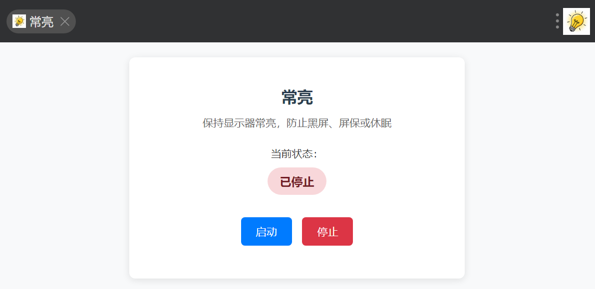
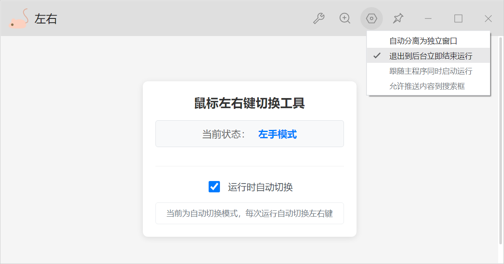

# uTools 插件集合

这是一个包含多个实用 uTools 插件的项目集合，旨在提供便捷的系统工具和功能增强。

## 📦 插件列表

### 1. 常亮 (Always On)



**功能简介**: 无须修改系统设置，即可保持显示与系统唤醒，有效阻止黑屏、屏保和系统睡眠。

**使用场景**:
- 等待重要消息或任务完成时，需要保持系统常亮，及时响应
- 办公室摸鱼玩手机时，不希望电脑黑屏或启动屏保，避免被老板抓包

**使用方法**:
- 启动插件：在 uTools 输入"常亮"或"alwayson"或"cl"并回车
- 插件会在后台保持显示器唤醒
- 可以通过插件界面的启动/停止，状态切换会显示通知

**关键词**: `常亮`, `alwayson`, `cl`

---

### 2. 鼠标左右键切换 (Mouse Switch)

**功能简介**: 快速切换鼠标左右键功能，为鼠标手患者提供便利。




**功能特点**:

- 自动显示当前鼠标左右手状态
- 一键切换鼠标左右键功能（支持配置项）
- 支持自动切换模式

**使用场景**:

- 鼠标手患者需要让其中一只手获得休息时间
- 需要临时调整鼠标操作习惯

**使用方法**:
1. 在 uTools 中安装此插件
2. 通过以下任一关键词唤起插件：
   - `鼠标切换`
   - `mouse switch`
   - `左右`
   - `zy`
   - `lr`
3. 插件会自动执行切换操作并显示结果

**配置选项**:
- `autoSwitch`: 运行时立即切换（默认关闭）

**注意事项**:
- 插件需要管理员权限才能修改鼠标设置
- 仅支持 Windows 系统

## 🚀 安装方法

### 方法一：通过 uTools 插件市场安装
1. 打开 uTools
2. 进入插件市场
3. 搜索对应插件名称进行安装

### 方法二：手动安装
1. 下载对应插件文件夹
2. 使用utools开发者工具读取项目文件，并构建离线安装包
3. 使用uTools安装.upxs离线安装包

## 📁 项目结构

```
utools_plugins/
├── always_on/              # 常亮插件
│   ├── index.html          # 插件界面
│   ├── preload.js          # 预加载脚本
│   ├── plugin.json         # 插件配置
│   ├── README.md           # 插件说明
│   └── logo.png            # 插件图标
├── mouse_switch/           # 鼠标切换插件
│   ├── index.html          # 插件界面
│   ├── preload.js          # 预加载脚本
│   ├── plugin.json         # 插件配置
│   ├── README.md           # 插件说明
│   └── logo.png            # 插件图标
└── uTools 开发者文档/      # 开发文档
    ├── 插件应用目录结构 _ uTools 开发者文档.md
    ├── plugin.json 配置 _ uTools 开发者文档.md
    ├── 事件 _ uTools 开发者文档.md
    └── ...                 # 其他开发文档
```

## 🛠️ 开发说明

### 技术栈
- **前端**: HTML, CSS, JavaScript
- **平台**: uTools API
- **系统支持**: Windows

### 开发环境
1. 安装 uTools 开发者工具
2. 克隆本仓库
3. 在 uTools 中加载插件进行调试

### 插件开发文档
项目包含完整的 uTools 开发文档，位于 `uTools 开发者文档/` 目录下，包括：
- 插件应用目录结构
- plugin.json 配置说明
- 事件处理
- 系统 API 使用
- 窗口管理
- 数据库操作
- 等等...

